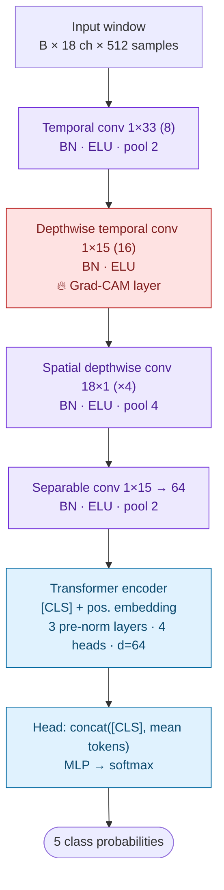

<div align="center">

# 🧠 EEG-CNN-Transformer

### An explainable CNN-Transformer framework for multi-disease EEG classification

[](#-quick-start)
[](#launch-the-interactive-dashboard)
[](#53-model-modelpy--118-k-parameters)
[](#55-explainability-explainpy)
[](#-limitations)

**Department of Artificial Intelligence, GHRCE Nagpur** · Session 2026–27

[Quick start](#-quick-start) •
[Test data](#-test-data-and-quick-checks) •
[Real datasets](#-using-the-real-datasets) •
[Method](#-method-details) •
[Outputs](#-outputs) •
[Limitations](#-limitations)

</div>

---

> [!WARNING]
> **Research use only.** Predictions are not medical advice, and this software is not a medical device.

## 📌 Overview

This research prototype **harmonizes EEG recordings from multiple public datasets**, trains a
**CNN-Transformer classifier**, and explains every prediction with **Grad-CAM** and **attention
rollout**. Synthetic EDF recordings and a pretrained checkpoint are bundled, so you can try the whole
workflow without downloading any real data.

<table>
<tr>
<td align="center"><b>🟢 Healthy</b></td>
<td align="center"><b>⚡ Epilepsy</b></td>
<td align="center"><b>🧩 Alzheimer</b></td>
<td align="center"><b>🤚 Parkinson</b></td>
<td align="center"><b>🌧️ Depression</b></td>
</tr>
</table>

Plus an optional binary task: **Seizure vs Non-seizure** on CHB-MIT.

### Pipeline

```mermaid
flowchart LR
    A[("Multiple EEG datasets<br/>EDF · BDF · BIDS")] --> B["Dataset harmonization<br/>montage · fs · labels"]
    B --> C["Preprocessing<br/>filter · notch · ICA · normalize"]
    C --> D["Window<br/>segmentation"]
    D --> E["CNN feature<br/>extraction"]
    E --> F["Transformer<br/>encoder"]
    F --> G["Multi-disease<br/>classification"]
    G --> H["Grad-CAM +<br/>attention XAI"]
    H --> I(["✅ Final prediction"])

    classDef data fill:#E0F2FE,stroke:#0369A1,color:#0C4A6E
    classDef prep fill:#FEF3C7,stroke:#B45309,color:#78350F
    classDef model fill:#EDE9FE,stroke:#6D28D9,color:#4C1D95
    classDef xai fill:#DCFCE7,stroke:#15803D,color:#14532D
    class A,B data
    class C,D prep
    class E,F,G model
    class H,I xai
```



---

## 🚀 Quick start

> [!TIP]
> Python **3.10 or newer** is recommended. Run all commands from the repository root.

### 1 · Install dependencies

<details open>
<summary><b>🪟 Windows (PowerShell)</b></summary>

```powershell
py -m venv .venv
.\.venv\Scripts\Activate.ps1
python -m pip install -r requirements.txt
```

</details>

<details>
<summary><b>🍎 macOS / 🐧 Linux</b></summary>

```bash
python3 -m venv .venv
source .venv/bin/activate
python -m pip install -r requirements.txt
```

</details>

### 2 · Launch the interactive dashboard

The dashboard uses the bundled `outputs/best_model.pt` checkpoint by default.

```bash
streamlit run app/streamlit_app.py
```

Open **<http://localhost:8501>**, then pick a bundled synthetic recording or upload your own EEG file
to see the prediction, class probabilities and explanation heat-maps.

### 3 · Train and evaluate

Rebuild the data cache, train, evaluate and generate explainability outputs in one command:

```bash
python -m eegct all
```

Artifacts are written to `outputs/`. Swap in a different configuration with `-c`:

```bash
python -m eegct all -c configs/seizure_chbmit.yaml
```

### 4 · Predict from the command line

```bash
python -m eegct predict data/synthetic/openneuro_ad/openneuro_ad_alz00_00.edf --ckpt outputs/best_model.pt
```

<details>
<summary><b>📋 CLI cheat-sheet</b></summary>

| Command | What it does |
|---|---|
| `python -m eegct all` | Build cache → train → evaluate → XAI |
| `python -m eegct all -c <config.yaml>` | Same, with a custom configuration |
| `python -m eegct predict <file> --ckpt <model.pt>` | Classify a single recording |
| `python -m eegct synth --out <dir> --duration 30 --scale 0.25` | Generate a fresh synthetic sample set |
| `python -m pytest -q` | Run the test suite |
| `streamlit run app/streamlit_app.py` | Launch the web dashboard |

</details>

---

## 🧪 Test data and quick checks

`data/synthetic/` contains synthetic EDF recordings laid out like **five different datasets**, plus a
`manifest.csv` with reference labels.

- **Dashboard:** choose **Bundled test sample** → pick a dataset and recording → **Analyze**. The
  reference class is shown alongside the prediction for comparison.
- **Command line:**

  ```bash
  python -m eegct predict data/synthetic/openneuro_ad/openneuro_ad_alz00_00.edf --ckpt outputs/best_model.pt
  ```

- **Test suite** (creates small temporary EDF fixtures; no external downloads):

  ```bash
  python -m pytest -q
  ```

- **Fresh sample set** (does not overwrite the bundled data):

  ```bash
  python -m eegct synth --out data/test_samples --duration 30 --scale 0.25
  python -m eegct predict data/test_samples/openneuro_ad/openneuro_ad_alz00_00.edf --ckpt outputs/best_model.pt
  ```

> [!NOTE]
> Synthetic recordings are for **software checks only**. Their labels and model scores are not clinical
> or scientific evidence. Use the real datasets below for research results.

---

## 🗂️ Project structure

<details>
<summary><b>Click to expand the repository tree</b></summary>

```text
EEG-CNN-Transformer/
├── configs/
│   ├── default.yaml            # every setting (datasets, harmonization, preprocessing, model, training)
│   ├── real_data.yaml          # all real public datasets enabled
│   ├── seizure_chbmit.yaml     # binary seizure detection on CHB-MIT
│   └── synthetic_seizure.yaml  # seizure detection demo on synthetic data
├── eegct/
│   ├── datasets.py     # loaders: CHB-MIT, TUH, OpenNeuro (BIDS) AD/PD, MODMA, EEGMMIDB, DEAP, CSV manifest
│   ├── harmonize.py    # channel-name normalisation, common montage, resampling, label mapping
│   ├── preprocess.py   # reading any format, band-pass + notch, ICA, windowing, normalization
│   ├── data.py         # window cache builder, subject-wise split, augmentation
│   ├── model.py        # CNN-Transformer
│   ├── explain.py      # Grad-CAM (channel × time) + attention rollout + figures
│   ├── train.py        # training loop, evaluation, metrics, plots
│   ├── predict.py      # inference on a new recording
│   ├── synthetic.py    # realistic synthetic multi-dataset EEG generator (EDF writer)
│   └── cli.py          # command-line interface (python -m eegct ...)
├── app/streamlit_app.py  # web demo: upload EEG → prediction + explanation
├── scripts/download_data.sh
├── tests/test_pipeline.py
└── outputs/            # created by training: best_model.pt, metrics, figures, xai/
```

</details>

---

## 📥 Using the real datasets

| Class | Dataset | Access | Location | Label source |
|---|---|---|---|---|
| ⚡ Epilepsy | CHB-MIT Scalp EEG (PhysioNet or Kaggle mirror) | Free | `data/raw/chbmit` | `chbXX-summary.txt` seizure times |
| 🟢 Healthy | TUH EEG Corpus – *normal* recordings | Free registration ([isip.piconepress.com](https://isip.piconepress.com)) | `data/raw/tuh_normal` | Folder (`abnormal/` skipped) |
| 🧩 Alzheimer (+ controls) | OpenNeuro **ds004504** | Free | `data/raw/ds004504` | `participants.tsv` Group: A → Alzheimer, C → Healthy, F (FTD) skipped |
| 🤚 Parkinson (+ controls) | OpenNeuro **ds002778** | Free | `data/raw/ds002778` | Subject id `sub-pd*` / `sub-hc*` |
| 🌧️ Depression (+ controls) | MODMA 128-ch resting EEG | Free registration ([modma.lzu.edu.cn](http://modma.lzu.edu.cn)) | `data/raw/modma` | Subjects xlsx (`type` MDD/HC) or `labels_file` CSV |
| 🟢 Healthy (extra) | PhysioNet EEGMMIDB baseline runs R01/R02 | Free | `data/raw/eegmmidb` | All healthy volunteers |
| 🟢 Healthy (extra) | DEAP (preprocessed `.dat`) | Free registration | `data/raw/deap` | All healthy volunteers |

```bash
bash scripts/download_data.sh                    # CHB-MIT subset, ds004504, ds002778, EEGMMIDB
# download TUH-normal and MODMA manually after registering, then:
python -m eegct all -c configs/real_data.yaml     # outputs in outputs_real/
python -m eegct all -c configs/seizure_chbmit.yaml
```

<details>
<summary><b>➕ Adding your own dataset (no code required)</b></summary>

Describe your recordings in a CSV manifest and enable `datasets.manifest` in the config:

```csv
path,label,subject[,dataset][,fs][,seizures]
```

**Supported formats:** EDF, EDF+, BDF, EEGLAB `.set`, FIF, BrainVision, GDF, MATLAB `.mat`, `.npy`, `.csv`.

</details>

<details>
<summary><b>🤔 Why use EEGMMIDB and DEAP?</b></summary>

EEGMMIDB and DEAP (listed in `fyp_data_1.pdf`) contain only healthy volunteers, so the framework uses
them as extra **Healthy-control** data from additional sites. Adding controls from several datasets
stops the model from learning *"which dataset is this"* instead of *"which disease is this"*.

</details>

> [!IMPORTANT]
> **Hardware for real data:** the full five-dataset run needs roughly **8–16 GB RAM** for the window
> cache. Use `max_files_per_subject`, `max_files`, `max_subjects` and `max_windows_per_recording` in the
> config to cap memory. A GPU helps but is not required — CUDA is used automatically when available.

---

## 🔬 Method details

<details open>
<summary><b>5.1 Dataset harmonization</b> — <code>harmonize.py</code></summary>

Datasets differ in sampling rate (128–512 Hz), channel naming (`EEG FP1-REF`, `Fp1.`, `T3` vs `T7`,
EGI `E22`…), reference, and montage (CHB-MIT is bipolar; the others are referential).

- **Channel names** are normalised to 10-20 names (old T3/T4/T5/T6 → T7/T8/P7/P8; EGI HydroCel-128
  electrodes → nearest 10-20 site).
- **Common montage:** 18-channel longitudinal bipolar *double banana* (FP1-F7 … CZ-PZ). CHB-MIT is
  recorded in this montage, and any referential recording converts to it exactly (A − B), making it the
  one montage all datasets can share without approximation. (`monopolar_1020`, 19 channels with average
  reference, is also available.)
- **Common sampling rate:** 128 Hz via anti-aliased polyphase resampling.
- **Label mapping:** dataset-specific group codes (A, C, HC, PD, MDD, …) map to the 5 unified classes.

</details>

<details>
<summary><b>5.2 Preprocessing</b> — <code>preprocess.py</code></summary>

| Step | Setting |
|---|---|
| Band-pass | 4th-order zero-phase Butterworth, 0.5–45 Hz |
| Notch | 50 Hz **and** 60 Hz (datasets come from both mains regions) |
| ICA (optional) | Ocular-artifact removal with FP1/FP2 as EOG proxies (`preprocessing.ica: true`) |
| Clipping | Amplitude clipping of extreme values |
| Windowing | 4 s windows, 50 % overlap (75 % around seizures) |
| Normalization | Per-channel robust z-score (median / IQR) — removes amplifier-gain differences between sites |

</details>

<details>
<summary><b>5.3 Model</b> — <code>model.py</code> (≈118 k parameters)</summary>



| Stage | Layer | Output shape (B = batch) |
|---|---|---|
| Input | Harmonized window | B × 18 ch × 512 samples |
| CNN | Temporal conv 1×33 (8 filters) + BN + ELU + pool 2 | B × 8 × 18 × 256 |
| CNN | Depthwise temporal conv 1×15 (16) + BN + ELU ← **Grad-CAM layer** | B × 16 × 18 × 256 |
| CNN | Spatial depthwise conv 18×1 (×4) + BN + ELU + pool 4 | B × 64 × 1 × 64 |
| CNN | Separable conv 1×15 → 64 + BN + ELU + pool 2 | B × 64 × 1 × 32 |
| Transformer | [CLS] + learnable positional embedding, 3 pre-norm layers, 4 heads, d = 64 | B × 33 × 64 |
| Head | concat([CLS], mean tokens) → MLP → softmax | B × 5 |

Each token covers **125 ms** of EEG. The CNN learns frequency and spatial filters; the Transformer
models long-range temporal dependencies across the 4 s window.

</details>

<details>
<summary><b>5.4 Training</b> — <code>train.py</code></summary>

- **Subject-wise split** 70 / 15 / 15, stratified by class. No person appears in both train and test.
  > Splitting windows at random lets the same subject leak into both sets — a leakage that inflates the
  > accuracy reported in many EEG papers.
- **Optimisation:** AdamW + One-Cycle LR, class-weighted cross-entropy with label smoothing, gradient clipping.
- **Augmentation:** amplitude scaling, time shift, Gaussian noise, channel dropout, polarity flip.
- **Early stopping** on validation macro-F1.
- **Metrics:** accuracy, balanced accuracy, macro-F1, ROC-AUC (one-vs-rest), per-class report,
  confusion matrix, **recording-level diagnosis** (window probabilities averaged per recording), and
  **per-dataset accuracy** (a generalisation check).

</details>

<details>
<summary><b>5.5 Explainability</b> — <code>explain.py</code></summary>

| Technique | What it shows |
|---|---|
| **Grad-CAM** | Applied to the last CNN layer that keeps the channel × time layout. Produces a heat-map of which **electrodes** and which **moments** drove the decision. |
| **Attention rollout** (Abnar & Zuidema, 2020) | Aggregated across all Transformer layers from the [CLS] token. Shows which **time segments** the Transformer relied on. |
| **Per-class channel importance** | Averaged over test windows and saved to `outputs/xai/top_channels_per_class.json`. |

</details>

---

## 📦 Outputs

After `python -m eegct all`, the `outputs/` folder contains:

| File | Contents |
|---|---|
| `best_model.pt` | Weights + config + class names |
| `history.json` | Per-epoch training history |
| `training_curves.png` | Loss / metric curves |
| `test_metrics.json` | Final test-set metrics |
| `confusion_matrix.png` | Confusion matrix |
| `split.npz` | Subject-wise train / val / test split |
| `xai/gradcam_<Class>_0.png` | Grad-CAM example for every class |
| `xai/top_channels_per_class.json` | Per-class channel importance |

---

## 📊 Results on the synthetic demo data

See [`RESULTS.md`](RESULTS.md), produced by the run included in this package.

> [!CAUTION]
> Real-data results will differ and are expected to be lower. Cross-subject, cross-dataset EEG
> diagnosis is a hard problem.

---

## 🎯 Mapping to the project objectives

| Objective (slide 7) | Implementation | |
|---|---|:---:|
| Integrate heterogeneous public EEG datasets | `datasets.py` (7 loaders + manifest) | ✅ |
| Preprocess and harmonize EEG signals | `harmonize.py`, `preprocess.py` | ✅ |
| Extract spatial features using CNN | `model.py` temporal + spatial conv blocks | ✅ |
| Capture temporal dependencies using Transformer | `model.py` encoder with multi-head attention | ✅ |
| Classify multiple neurological disorders | 5-class head, `train.py` | ✅ |
| Improve interpretability using Grad-CAM | `explain.py`, `app/streamlit_app.py` | ✅ |

---

## ⚠️ Limitations

- **Site–disease confounding.** Each disease comes mostly from one dataset, so disease and recording
  site are partly confounded. Harmonization and multi-site healthy controls reduce this but do not
  remove it. Report the per-dataset accuracy and, where possible, validate on an external dataset.
- **Not a medical device.** This is a research prototype.

---

<div align="center">

Made at the **Department of Artificial Intelligence, GHRCE Nagpur** · 2026–27

<a href="#-eeg-cnn-transformer">⬆ Back to top</a>

</div>
